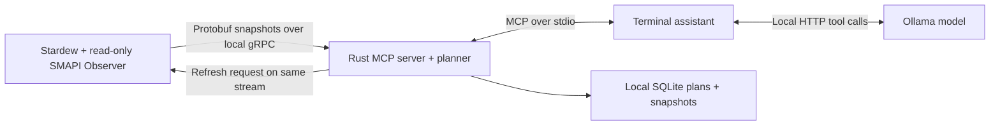

# Stardew Earnings Assistant

A local, read-only Stardew Valley earnings advisor for Windows and Linux. A C# SMAPI mod observes your running single-player farm, a Rust MCP server calculates crop plans, and a bundled terminal assistant explains those calculations through Ollama. You perform every game action.

The default objective is **cash received by the end of the current season**. Direct crop sales pay immediately; shipping pays the following morning. The planner uses all available cash unless you set a reserve.

## Quick start

Requirements:

- Stardew Valley **1.6.x** on Windows or Linux. The observer detects the installed version at runtime and rejects incompatible versions.
- [SMAPI](https://smapi.io/) installed into the game. Follow its Windows/Linux installer instructions and launch the game through SMAPI. The user starts with an unmodded game; this project adds only the read-only observer.
- A current stable [Rust toolchain](https://rustup.rs/) and [.NET 8 SDK](https://dotnet.microsoft.com/download/dotnet/8.0). The mod targets the game's .NET 6 runtime; the SDK also builds protocol checks.
- [Ollama](https://ollama.com/) for natural-language chat. Direct terminal planning commands work without a model.
- Windows Rust builds require the Visual Studio C++ build tools. Linux requires a C compiler/build tools for bundled SQLite. Protobuf tooling is supplied by the build; no separate `protoc` installation is needed.

Clone the repository, then build:

```sh
git clone https://github.com/TorratDev/sv-optimizer.git
cd sv-optimizer
cargo build --release --locked
dotnet build mod/Observer/Observer.csproj -c Release -p:GamePath="/path/to/Stardew Valley"
```

The SMAPI build package can detect common game installations. Supply `GamePath` explicitly if detection fails. Put the contents of `mod/Observer/bin/Release/net6.0` in `Stardew Valley/Mods/SvOptimizer.Observer/`, including `manifest.json` and the managed dependency DLLs. Do not copy the game or SMAPI assemblies into the mod directory.

Convenience scripts build both components and optionally install the mod:

```sh
# Linux
bash scripts/setup.sh --game-path "/path/to/Stardew Valley" --install-mod
```

```powershell
# Windows
powershell -ExecutionPolicy Bypass -File scripts/setup.ps1 -GamePath "C:\Games\Stardew Valley" -InstallMod
```

The scripts print the hardware recommendation; they never install SMAPI or download a model automatically. An existing observer directory is backed up before installation.

Start the game and load your single-player farm before checking model performance:

```sh
target/release/sv-optimizer doctor --hardware-only
# Explicit download step: use the model recommended on YOUR computer.
ollama pull qwen3:4b
target/release/sv-optimizer doctor --model qwen3:4b
target/release/sv-optimizer chat --model qwen3:4b
```

On Windows the executable is `target\release\sv-optimizer.exe`. Ollama must be running. `doctor` detects available RAM and NVIDIA VRAM when available, suggests a model size, and tests a real tool call and its latency. Other GPUs use a conservative RAM-based recommendation; Ollama selects supported acceleration. A recommendation is a starting point, not a guarantee of speed. Run it with the game open and use a smaller model if necessary.

Without `--model`, chat selects the hardware recommendation **only if that model is already installed**. No silent download or switch occurs. If Ollama is unavailable, direct commands remain usable:

```sh
target/release/sv-optimizer chat --no-model
```

Try `Plan earnings through the end of this season`, or use:

```text
/snapshot
/compare
/plan
/plan 7
/progress
/details
/constraints {"watering_capacity":120,"time_limit_ms":3000}
/hardware
/quit
```

`/plan 7` includes today and stops at season day 28. `/details` expands the saved checklist with tile coordinates, calculation assumptions and work estimates. `/progress` compares the current farm to the saved plan; it offers recalculation rather than replacing a plan automatically. Natural-language replies are model-generated, but direct `/plan` output comes straight from the calculation.

## Try a simulated farm without the game

```sh
cargo run -- --data-dir work/demo --fixture fixtures/spring-demo.json plan --horizon-days 28
cargo run -- --data-dir work/demo --fixture fixtures/spring-demo.json chat --no-model
```

Fixture mode is labelled **SIMULATION**. It does not observe or modify a real save. This is useful for developing the Rust planner before setting up SMAPI.

## Architecture



`proto/farm.proto` is the shared versioned contract. The Rust process hosts a loopback gRPC service; the mod is its client, avoiding an ASP.NET server dependency inside the game. A bidirectional stream carries detached snapshots and refresh requests. SMAPI captures all game state on the game thread; background tasks handle networking without touching game objects.

Snapshots include money, inventory, accessible farm-chest contents, crop phases, plots, fertilizer, sprinkler coverage, equipment, skills, professions, date, observed weather, shop calendars and available recipes. The observer captures each morning and on request. Returning to the title invalidates the live world. Planning requires a refreshed, loaded single-player save; an old persisted snapshot cannot silently be used as live state.

The bridge is bound to `127.0.0.1:52761` by default and authenticated with a per-run token in `bridge.json`. Rust and the mod share a local data directory:

| Platform | Default directory |
| --- | --- |
| Windows | `%LOCALAPPDATA%\sv-optimizer` |
| Linux | `~/.local/share/sv-optimizer` |

Override with `SV_OPTIMIZER_DATA_DIR`, or use `--data-dir` and the same `DataDirectory` in the mod's generated `config.json`. If you customize `XDG_DATA_HOME`, set the directory explicitly in both components. Linux data-directory/config permissions are private to the user.

The terminal launches the MCP subprocess itself. Use either terminal chat or an external MCP client as the owner of the server; two servers cannot bind the same bridge port. `--port` changes the bridge port and publishes the new address to the observer.

To connect another local MCP client:

```json
{
  "mcpServers": {
    "sv-optimizer": {
      "command": "/absolute/path/to/sv-optimizer",
      "args": ["mcp"]
    }
  }
}
```

The local model never calculates the optimization itself. Its tools are:

| Tool | Behavior |
| --- | --- |
| `get_farm_snapshot(refresh=true)` | Refresh and read the loaded farm; `false` explicitly returns historical state. |
| `compare_investments(horizon_days?, constraints?)` | Compare crop returns and list sprinkler purchase/crafting inputs. Per-plot figures are not a full feasible plan. |
| `plan_earnings(horizon_days?, constraints?)` | Calculate and persist a daily plan with costs, cash timing, expected/conservative returns and assumptions. |
| `check_plan_progress()` | Compare morning cash, crops and observed harvest timing with the saved plan for this save/player. |

## Planning model

The search simulates several investment policies, with and without sprinkler investments, and keeps the completed plan with the highest expected deadline cash. A no-new-investment baseline provides a fallback if the time limit expires. Results are labelled **`feasible_estimate`**, never proven globally optimal.

The modeled rules include:

- Main-farm outdoor plots, existing crops and regrowth, same-season growth deadlines, existing speed/quality fertilizer, and farming professions.
- Actual crop selling prices for each quality, read through the game's price calculation, including the current profit margin and professions. Expected quality and yield are calculated; spending uses minimum modeled receipts.
- Shared daily cash, seed inventory, limited stock, unlocked recipes and store availability. Purchases from the same shop are grouped into a single visit.
- Estimated manual watering capacity from energy and equipment, plus an override. Only observed rain/forecast is assumed. New sprinklers and newly tilled soil receive special treatment on their first day.
- Crop replacement when its modeled gain exceeds the remaining harvest opportunity cost. Unknown crops are preserved.
- Conservative travel, chest retrieval, clearing, tilling, planting and harvest budgets. Shop-opening waits count as time. Existing farm plots are prioritized; new plot count and observation size are configurable.
- Owned sprinklers, direct purchases and crafting with owned or purchasable **recipe ingredients**. Placement consumes an empty tile; investment benefit is checked by a complete simulation.
- Direct sales during reachable shop hours and shipping only when its next-day payment falls within the deadline. Egg Festival seed purchases, when present in game shop data, account for the 22:00 return.

Default constraints:

```json
{
  "reserve_gold": 0,
  "watering_capacity": null,
  "daily_energy": null,
  "daily_minutes": null,
  "travel_buffer_minutes": 60,
  "sleep_at": 2400,
  "allow_clearing": true,
  "allow_replacement": true,
  "allow_sprinkler_investment": true,
  "max_new_plots": 200,
  "time_limit_ms": 3000
}
```

Null means use the observation-derived estimate. For MCP calls, omit an optional constraint rather than sending null: the input schema declares the concrete value type. Work budgets include travel and shop waits; the extra buffer covers approximate routes/refills and the trip home. Existing over-capacity crops may be left unwatered and their harvests delayed, with explicit warnings.

**Model boundaries:** greenhouse/Ginger Island, multiplayer, machines for crop processing, buying food, non-crop liquidation, ore smelting, new furnace investments, trellis routing for new plantings, forage crop mechanics, paddy proximity bonuses, giant crops, mixed seeds, retaining-soil randomness, rare luck bonuses, future skill/unlock changes and random/dynamic shop queries are excluded. Existing compatible trellis crops can be observed and harvested, but no new trellis layout is planned. The snapshot reports excluded or unsupported options. Existing fertilizer is used; purchases of fertilizer are not optimized.

Time/energy estimates and fixed future unlocks make feasibility conditional on stated assumptions. Conservative cash is not a guarantee against crows, lightning, missed actions, depleted resources or inaccurate travel estimates. Progress compares a **morning checkpoint**; midday purchases/harvests can explain differences. Request a new plan when the actual farm changes.

## Development and validation

```sh
cargo fmt --check
cargo clippy --all-targets --locked -- -D warnings
cargo test --locked
dotnet build mod/ProtocolChecks/ProtocolChecks.csproj
dotnet run --project mod/ProtocolChecks --no-build
cargo build --locked
python3 tests/cross_language.py
python3 tests/terminal_chat.py
```

The cross-language check uses a real C# gRPC client, Rust server and MCP requests without game assemblies. The terminal check uses an Ollama API mock, not a downloaded model. Native Rust tests cover cash timing, finite stock, daily work budgets, crop replacement/preservation, regrowth, quality, sprinkler activation, chest retrieval, persistence, progress, and bridge authentication.

For a compile check without a game installation, use **your SMAPI release's API DLLs**:

```sh
dotnet build mod/Observer/Observer.csproj -p:SmapiApiPath="/directory/containing/StardewModdingAPI-and-SMAPI.Toolkit.CoreInterfaces-DLLs"
```

This verifies the SMAPI entry point and managed dependencies. It does not validate reflection member access or behavior in a running Stardew save. Before treating a release as game-validated, complete [the in-game checklist](docs/game-validation.md) on Windows and Linux. No proprietary game binaries are included in this repository.

For someone experienced with C# and new to Rust: `src/planner.rs` contains synchronous, deterministic simulations; `src/state.rs` coordinates snapshots and tool calls; `src/bridge.rs` handles typed async gRPC; `src/mcp.rs` handles stdio JSON-RPC; `src/chat.rs` is the client and Ollama loop. The planner runs in `spawn_blocking` so it cannot block bridge communication. Shared state uses `Arc`, a Tokio `RwLock` for snapshots, and a mutex around SQLite.
